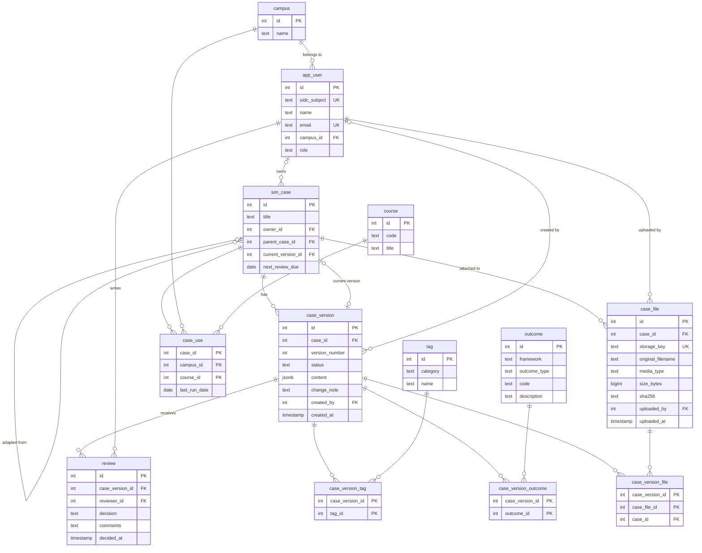

# Entity relationship diagram

Source of truth: [`db/schema.sql`](../db/schema.sql). Update this diagram in the same PR as any schema change.

```mermaid
erDiagram
  campus ||--o{ app_user : "belongs to"
  app_user |o--o{ sim_case : owns
  sim_case |o--o{ sim_case : "adapted from"
  sim_case ||--o{ case_version : has
  sim_case |o--o| case_version : "current version"
  app_user |o--o{ case_version : "created by"
  case_version ||--o{ review : receives
  app_user ||--o{ review : writes
  case_version ||--o{ case_version_tag : ""
  tag ||--o{ case_version_tag : ""
  case_version ||--o{ case_version_outcome : ""
  outcome ||--o{ case_version_outcome : ""
  sim_case ||--o{ case_use : ""
  campus ||--o{ case_use : ""
  course ||--o{ case_use : ""
  sim_case ||--o{ case_file : "attached to"
  app_user ||--o{ case_file : "uploaded by"
  case_version ||--o{ case_version_file : ""
  case_file ||--o{ case_version_file : ""

  campus {
    int id PK
    text name
  }
  app_user {
    int id PK
    text oidc_subject UK
    text name
    text email UK
    int campus_id FK
    text role
  }
  course {
    int id PK
    text code
    text title
  }
  outcome {
    int id PK
    text framework
    text outcome_type
    text code
    text description
  }
  sim_case {
    int id PK
    text title
    int owner_id FK
    int parent_case_id FK
    int current_version_id FK
    date next_review_due
  }
  case_version {
    int id PK
    int case_id FK
    int version_number
    text status
    jsonb content
    text change_note
    int created_by FK
    timestamp created_at
  }
  tag {
    int id PK
    text category
    text name
  }
  case_version_tag {
    int case_version_id PK
    int tag_id PK
  }
  case_use {
    int case_id PK
    int campus_id PK
    int course_id PK
    date last_run_date
  }
  case_version_outcome {
    int case_version_id PK
    int outcome_id PK
  }
  review {
    int id PK
    int case_version_id FK
    int reviewer_id FK
    text decision
    text comments
    timestamp decided_at
  }
  case_file {
    int id PK
    int case_id FK
    text storage_key UK
    text original_filename
    text media_type
    bigint size_bytes
    text sha256
    int uploaded_by FK
    timestamp uploaded_at
  }
  case_version_file {
    int case_version_id PK
    int case_file_id PK
    int case_id FK
  }
```
